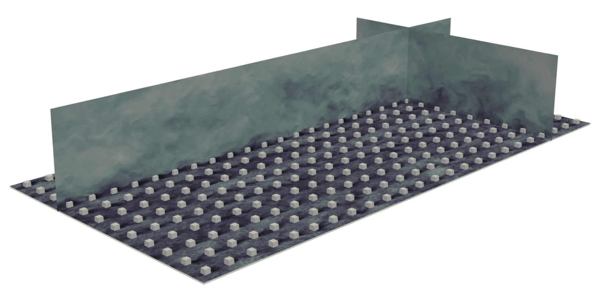

My [research](https://atharvasathe12.github.io/research/) aims to deepen our understanding of roughness-induced secondary flows, ultimately enhancing our ability to predict and model the atmospheric boundary layer.
For these investigations, I use Large Eddy Simulations to model turbulent flows over both resolved obstacles and parameterized roughness elements.

I am currently a Ph.D. candidate at Columbia University, where I'm advised by [Prof. Marco G. Giometto](https://www.civil.columbia.edu/content/marco-giovanni-giometto).
I also closely collaborate with [Prof. Marc Calaf](https://www.mech.utah.edu/directory/faculty/marc-calaf/) and [Prof. William Anderson](https://me.utdallas.edu/people/faculty/william-anderson/).
My expected graduation date is Fall 2025, and I'm currently looking for postdoctoral opportunities starting in Spring 2026.
Previously, I earned a Bachelor’s and Master’s degree in Technology in Aerospace Engineering from IIT Bombay.

