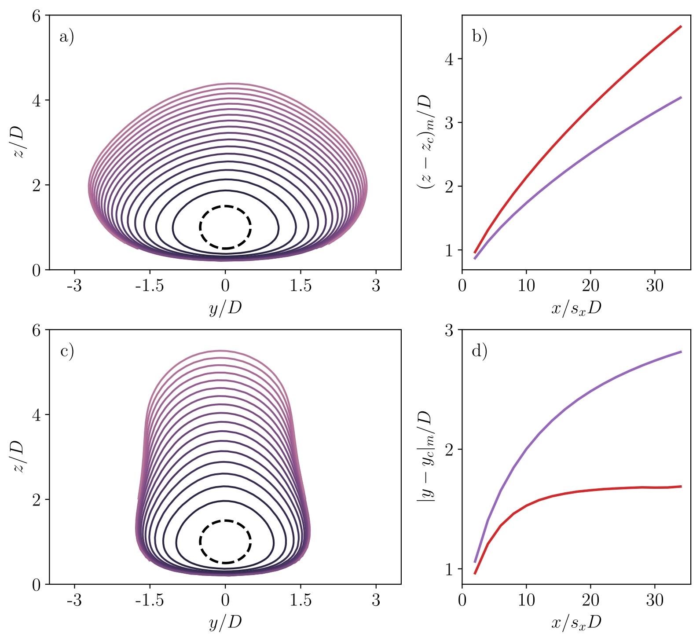



<!-- This webpage is currently under development. Please check back later for updates. -->

<!-- Specifying research title -->
## On the structure and dynamics of secondary flows over multi-column roughness in turbulent boundary layers
**Advisor: [Prof. Marco G. Giometto](https://www.civil.columbia.edu/content/marco-giovanni-giometto)**, **Collaborators: [Prof. William Anderson](https://me.utdallas.edu/people/faculty/william-anderson/), [Prof. Marc Calaf](https://www.mech.utah.edu/directory/faculty/marc-calaf/)**

**Publication status: Manuscript in preparation for *JFM*. Results presented at APS DFD 2024 and AGU Fall Meeting 2024.**

**Overview**:

This research seeks to examine the parameters of roughness configurations that are crucial in determining the alignment of high- and low-momentum pathways induced by secondary flows. 
Since the alignment of these pathways significantly influences performance-critical quantities such as drag and heat transfer, identifying these parameters is essential to improving our predictive capabilities.
To examine these effects in a physically relevant setting, we use wind turbines as roughness elements—reflecting their role as porous obstacles in applications such as wind farms and other complex surface environments.

**Highlights**:

1. Discovered that the spanwise gap between edge-most roughness elements of adjacent columns is a key geometric parameter that dictates the polarity of secondary flows—a governing factor previously unrecognized in the literature.
2. Showcased that secondary flows fundamentally alter *mke* entrainment pathways; notably, the expected increase in lateral entrainment with wider spanwise spacing can reverse due to the interplay between high-momentum fluid availability and strong advective downdrafts over roughness elements.. 
3. Demonstrated that the strength of secondary flows is not diminished in intermediate configurations; rather, frequent polarity reversals lead to a misleading appearance of their absence in long-time-averaged fields.
4. Showed that in all cases, including those with strong polarity in the time-averaged flow field, the high- and low-momentum pathways undergo chaotic, non-periodic switching over time.
5. Found that, despite markedly different mean flow structures, the vertical velocity signal exhibits similar quasi-periodic oscillations across all cases, indicating that frequent pathway switching reflects a near-zero mean state rather than an inherently chaotic fluctuation pattern.
6. Established that variability in vertical momentum transport is a fundamental and persistent feature of roughness-induced secondary flows.

  

Figure 1: Influence of secondary flows on the entrainment of <i>mke</i>. (a) No secondary flow: spanwise spacing = 10D. (c) With secondary flow: spacing = 15D. Panels (b) and (d) compare the tube height and width at different upstream locations: Purple (10D), Red (15D) (highlight #2)

Figure 2: Instantaneous reversal of secondary flow structures (highlight #3)

## Impact of the numerical domain on turbulent flow statistics: scalings and considerations for canopy flows
**Advisor: [Prof. Marco G. Giometto](https://www.civil.columbia.edu/content/marco-giovanni-giometto)**

**Publication status: Published in *JFM* ([link](https://www.cambridge.org/core/journals/journal-of-fluid-mechanics/article/impact-of-the-numerical-domain-on-turbulent-flow-statistics-scalings-and-considerations-for-canopy-flows/15C2D590F6004128CDF73822D171ABE6)). Results presented at APS DFD 2023 and AGU Fall Meetings 2022 and 2023.**

**Overview**:

Large Eddy Simulations (LES) are widely used to study the effects of surface morphology on turbulence statistics, exchange processes, and turbulence topology in urban canopies. 
However, as LES are only approximations of reality, special attention is needed for the computational model setup to ensure an accurate representation of the physical processes of interest. 
This study shows that the choice of the numerical domain can significantly impact the accuracy of turbulent flow statistics, potentially causing a mismatch between numerical studies and experimental data.

**Highlights**:

1. Demonstrated that a narrow domain (width/height << 3.0) may be insufficient to accommodate both fast and slow turbulent streaks, leading to the artificial disruption of turbulent coherence. This results in an underprediction of second-order statistics.
This results in underprediction of second-order statistics.
1. Showed that a short domain (length/height << 6.0) may artificially enhance turbulent coherence due to excessive periodization, which leads to an overprediction of second-order statistics.
1. Proved that the widely used conventional method for testing the impact of scale separation in canopy flow simulations contains significant flaws and proposed a novel alternative method that isolates the impact of scale separation with greater accuracy.
1. Showed, using the aforementioned method, that domains with small scale separation may dampen turbulent fluctuations in the outer layer due to their close proximity to the upper boundary.
1. Established that scale separation is not the sole parameter governing the existence of an inertial sublayer in the atmosphere; the underlying arrangement of canopy elements also plays a significant role, a fact previously unknown in the literature.

<!-- |  | -->

Figure 3: Artificial disruption of turbulent coherence due to narrow domain (highlight #1)

