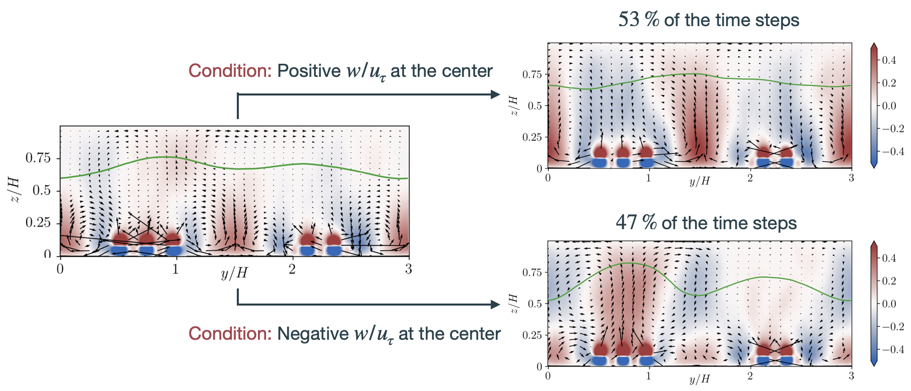



<!-- This webpage is currently under development. Please check back later for updates. -->

<!-- Specifying research title -->
## Reversal of mean and instantaneous secondary flow structures in multi-column roughness configurations
**Advisor: [Prof. Marco G. Giometto](https://www.civil.columbia.edu/content/marco-giovanni-giometto)**, **Collaborators: [Prof. William Anderson](https://me.utdallas.edu/people/faculty/william-anderson/), [Prof. Marc Calaf](https://www.mech.utah.edu/directory/faculty/marc-calaf/)**

**Publication status: Manuscript is currently under preparation for consideration in *JFM*.**

**Overview**:

This research seeks to examine the parameters of roughness configurations that are crucial in determining the alignment of high- and low-momentum pathways induced by secondary flows. 
Since the alignment of these pathways significantly influences performance-critical quantities such as drag and heat transfer, identifying these parameters is essential to improving our predictive capabilities.

**Highlights**:

1. Discovered that gap between roughness elements of neighboring columns is a crucial parameter which dictates the alignment of aforementioned pathways, a parameter previously unknown in the literature.
2. Demonstrated that the strength of secondary flows is not diminished in intermediate configurations. In these configurations, the secondary flows undergo frequent, instantaneous rearrangements, which results in a misleading appearance of their destruction in long-time averaged flow fields.

*Figure 1: Instantaneous reversal of secondary flow structures (highlight #2)*

## Impact of the numerical domain on turbulent flow statistics: scalings and considerations for canopy flows
**Advisor: [Prof. Marco G. Giometto](https://www.civil.columbia.edu/content/marco-giovanni-giometto)**

**Publication status: Published in *JFM*. ([link](https://www.cambridge.org/core/journals/journal-of-fluid-mechanics/article/impact-of-the-numerical-domain-on-turbulent-flow-statistics-scalings-and-considerations-for-canopy-flows/15C2D590F6004128CDF73822D171ABE6))**

**Overview**:

Large Eddy Simulations (LES) are widely used to study the effects of surface morphology on turbulence statistics, exchange processes, and turbulence topology in urban canopies. 
However, as LES are only approximations of reality, special attention is needed for the computational model setup to ensure an accurate representation of the physical processes of interest. 
This study shows that the choice of the numerical domain can significantly impact the accuracy of turbulent flow statistics, potentially causing a mismatch between numerical studies and experimental data.

**Highlights**:

1. Demonstrated that a narrow domain (width/height << 3.0) may be insufficient to accommodate both fast and slow turbulent streaks, leading to the artificial disruption of turbulent coherence. This results in an underprediction of second-order statistics.
This results in underprediction of second-order statistics.
1. Showed that a short domain (length/height << 6.0) may artificially enhance turbulent coherence due to excessive periodization, which leads to an overprediction of second-order statistics.
1. Proved that the widely used conventional method for testing the impact of scale separation in canopy flow simulations contains significant flaws and proposed a novel alternative method that isolates the impact of scale separation with greater accuracy.
1. Showed, using the aforementioned method, that domains with small scale separation may dampen turbulent fluctuations in the outer layer due to their close proximity to the upper boundary.
1. Established that scale separation is not the sole parameter governing the existence of an inertial sublayer in the atmosphere; the underlying arrangement of canopy elements also plays a significant role, a fact previously unknown in the literature.

<!-- |  | -->

*Figure 2: Artificial disruption of turbulent coherence due to narrow domain (highlight #1)*
